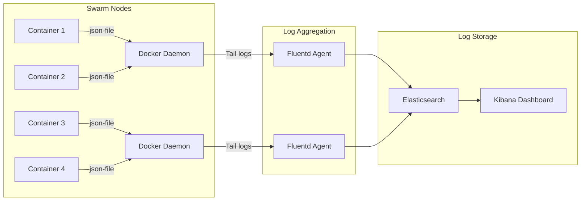

# Centralized Logging Architecture

> Task 4.2: Logging with Syslog/Fluentd

## Logging Strategy Overview

Docker Swarm provides several logging drivers for centralized log collection. This document outlines our recommended approach using JSON-file logging with Fluentd aggregation.

## Architecture



---

## Option 1: JSON-File with Log Rotation (Recommended for Swarm)

This is our primary approach, configured in `docker-compose.yml`:

```yaml
services:
  backend:
    logging:
      driver: "json-file"
      options:
        max-size: "10m"      # Max log file size
        max-file: "3"        # Keep 3 rotated files
        labels: "service"    # Include labels in log output
        tag: "{{.Name}}/{{.ID}}"  # Custom log tag
```

### Advantages
- ✅ Native Docker support, no external dependencies
- ✅ Logs persist across container restarts
- ✅ Works with `docker service logs` command
- ✅ Easy to debug with direct file access

### Log Location
```bash
# Logs stored at:
/var/lib/docker/containers/<container-id>/<container-id>-json.log

# View logs directly
docker service logs myapp_backend --tail 100 -f
```

---

## Option 2: Syslog Driver

For integration with existing syslog infrastructure:

```yaml
services:
  backend:
    logging:
      driver: "syslog"
      options:
        syslog-address: "tcp://syslog-server:514"
        syslog-facility: "daemon"
        tag: "{{.Name}}/{{.ID}}"
        syslog-format: "rfc5424"
```

### Syslog Server Configuration (rsyslog)

```bash
# /etc/rsyslog.d/50-docker.conf
$ModLoad imtcp
$InputTCPServerRun 514

# Template for structured logging
$template DockerLogs,"/var/log/docker/%HOSTNAME%/%PROGRAMNAME%.log"

# Route Docker logs
:syslogtag, startswith, "docker" ?DockerLogs
& stop
```

---

## Option 3: Fluentd for Advanced Processing

### Fluentd Stack Deployment

```yaml
# Add to monitoring stack
services:
  fluentd:
    image: fluent/fluentd:v1.16-1
    networks:
      - monitoring
    volumes:
      - ./fluent.conf:/fluentd/etc/fluent.conf:ro
      - /var/lib/docker/containers:/var/lib/docker/containers:ro
    deploy:
      mode: global
      resources:
        limits:
          cpus: '0.5'
          memory: 256M
    ports:
      - "24224:24224"
      - "24224:24224/udp"
```

### Fluentd Configuration (fluent.conf)

```xml
# Input: Docker container logs
<source>
  @type tail
  path /var/lib/docker/containers/*/*-json.log
  pos_file /var/log/fluentd-containers.log.pos
  tag docker.*
  read_from_head true
  <parse>
    @type json
    time_key time
    time_format %Y-%m-%dT%H:%M:%S.%NZ
  </parse>
</source>

# Parse Docker JSON logs
<filter docker.**>
  @type parser
  key_name log
  reserve_data true
  <parse>
    @type json
  </parse>
</filter>

# Add metadata
<filter docker.**>
  @type record_transformer
  <record>
    hostname "#{Socket.gethostname}"
    environment production
  </record>
</filter>

# Output: Elasticsearch
<match docker.**>
  @type elasticsearch
  host elasticsearch
  port 9200
  logstash_format true
  logstash_prefix docker-logs
  <buffer>
    @type file
    path /var/log/fluentd-buffers/docker.buffer
    flush_interval 5s
    chunk_limit_size 2M
    queue_limit_length 8
    retry_max_interval 30
    retry_forever true
  </buffer>
</match>

# Output: Also write to file for debugging
<match docker.**>
  @type file
  path /var/log/fluent/docker
  <buffer time>
    @type file
    path /var/log/fluent/buffer/docker
    timekey 1d
    timekey_wait 10m
    flush_mode interval
    flush_interval 30s
  </buffer>
  <format>
    @type json
  </format>
</match>
```

---

## Log Retention Policies

### Docker Daemon Level

Configure in `/etc/docker/daemon.json`:

```json
{
  "log-driver": "json-file",
  "log-opts": {
    "max-size": "10m",
    "max-file": "5",
    "compress": "true"
  }
}
```

### Elasticsearch Index Lifecycle

```json
{
  "policy": {
    "phases": {
      "hot": {
        "min_age": "0ms",
        "actions": {
          "rollover": {
            "max_size": "50gb",
            "max_age": "7d"
          }
        }
      },
      "warm": {
        "min_age": "7d",
        "actions": {
          "shrink": { "number_of_shards": 1 },
          "forcemerge": { "max_num_segments": 1 }
        }
      },
      "delete": {
        "min_age": "30d",
        "actions": { "delete": {} }
      }
    }
  }
}
```

---

## Structured Logging (JSON Format)

### Application Configuration

Configure applications to output JSON logs:

**Node.js (Winston)**:
```javascript
const winston = require('winston');
const logger = winston.createLogger({
  format: winston.format.combine(
    winston.format.timestamp(),
    winston.format.json()
  ),
  transports: [new winston.transports.Console()]
});
```

**Python (structlog)**:
```python
import structlog
structlog.configure(
    processors=[
        structlog.processors.JSONRenderer()
    ]
)
```

### Log Format Standards

```json
{
  "timestamp": "2024-01-15T10:30:00.000Z",
  "level": "info",
  "service": "backend-api",
  "request_id": "abc-123",
  "user_id": "user-456",
  "action": "user.login",
  "duration_ms": 45,
  "message": "User logged in successfully"
}
```

---

## Viewing and Debugging Logs

```bash
# View service logs (all replicas)
docker service logs myapp_backend -f --tail 100

# View specific task logs
docker service ps myapp_backend
docker logs <task_id>

# Follow logs with timestamps
docker service logs myapp_backend -f -t

# Filter by time
docker service logs myapp_backend --since 2024-01-15T10:00:00

# View logs across all services in stack
for svc in $(docker service ls --filter "label=com.docker.stack.namespace=myapp" -q); do
  echo "=== $svc ==="
  docker service logs $svc --tail 10
done
```
