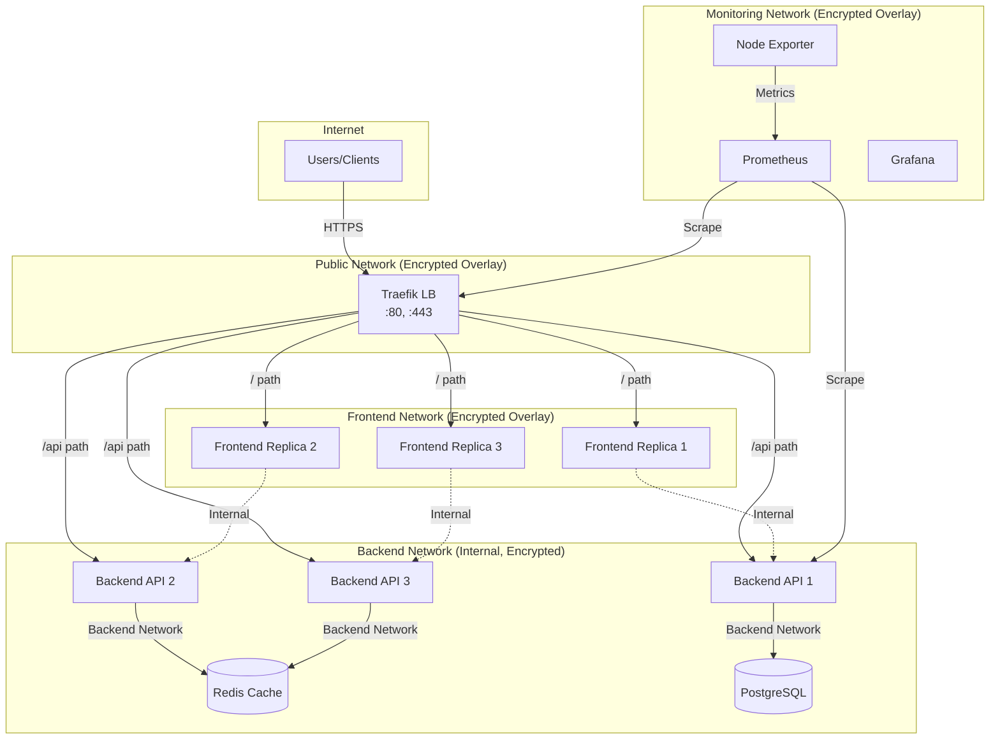

# Docker Swarm Networking & Service Discovery

> Task 2.1 and 2.2: Overlay Network Design and Ingress Configuration

## Network Architecture Overview

Our multi-tier network architecture provides security isolation between different application layers:



## Network Isolation Strategy

| Network | Purpose | Encryption | Internal | Services |
|---------|---------|------------|----------|----------|
| `public` | Ingress/Load Balancer | ✅ Yes | No | Traefik |
| `frontend` | Frontend ↔ Backend | ✅ Yes | No | Frontend, Backend, Traefik |
| `backend` | Backend ↔ Database | ✅ Yes | ✅ Yes | Backend, PostgreSQL, Redis |
| `monitoring` | Observability Stack | ✅ Yes | No | Prometheus, Grafana, Exporters |

---

## Network Creation Commands

### Create Overlay Networks

```bash
# Initialize Swarm first (if not already done)
docker swarm init --advertise-addr eth0

# Create the public network (external traffic)
docker network create \
  --driver overlay \
  --opt encrypted \
  --attachable \
  public

# Create the frontend network (frontend to backend communication)
docker network create \
  --driver overlay \
  --opt encrypted \
  --attachable \
  frontend

# Create the backend network (internal only - no external access)
docker network create \
  --driver overlay \
  --opt encrypted \
  --internal \
  --attachable \
  backend

# Create the monitoring network
docker network create \
  --driver overlay \
  --opt encrypted \
  --attachable \
  monitoring
```

### Verify Network Configuration

```bash
# List all networks
docker network ls --filter driver=overlay

# Inspect network details
docker network inspect public
docker network inspect backend --format '{{.Internal}}'

# Check which services are connected to a network
docker network inspect frontend --format '{{range .Containers}}{{.Name}} {{end}}'
```

---

## Service Discovery

Docker Swarm provides built-in DNS-based service discovery. Services can communicate using:

1. **Service Name**: `http://backend:5000/api`
2. **Task DNS**: `http://backend.1.taskid:5000` (specific replica)
3. **Stack-qualified**: `http://myapp_backend:5000` (when deployed as stack)

### DNS Resolution Examples

```bash
# From within a container, resolve service DNS
docker exec -it <container_id> nslookup backend

# Test connectivity between services
docker exec -it <frontend_container> wget -qO- http://backend:5000/health

# List tasks for a service (each gets DNS entry)
docker service ps myapp_backend --format "{{.Name}}: {{.CurrentState}}"
```

### Service Communication Flow

```
Frontend Container
    ↓ (DNS lookup: "backend")
Swarm DNS (127.0.0.11)
    ↓ (returns VIP: 10.0.x.x)
Backend Service VIP (Virtual IP)
    ↓ (IPVS load balancing)
Backend Container Replicas
```

---

## Ingress Configuration Deep Dive

### Traefik Labels for Service Routing

Our docker-compose.yml uses Traefik labels for dynamic service discovery:

```yaml
# Frontend routing (serves on /)
labels:
  - "traefik.enable=true"
  - "traefik.http.routers.frontend.rule=Host(`app.example.com`)"
  - "traefik.http.routers.frontend.entrypoints=websecure"
  - "traefik.http.routers.frontend.tls.certresolver=letsencrypt"
  - "traefik.http.services.frontend.loadbalancer.server.port=3000"

# Backend API routing (serves on /api)
labels:
  - "traefik.enable=true"
  - "traefik.http.routers.backend.rule=Host(`app.example.com`) && PathPrefix(`/api`)"
  - "traefik.http.routers.backend.entrypoints=websecure"
  - "traefik.http.routers.backend.tls.certresolver=letsencrypt"
  - "traefik.http.services.backend.loadbalancer.server.port=5000"
  - "traefik.http.services.backend.loadbalancer.sticky.cookie=true"
  - "traefik.http.services.backend.loadbalancer.sticky.cookie.name=backend_affinity"
```

### Host-Based Routing (Multiple Domains)

```yaml
# Main application
- "traefik.http.routers.app.rule=Host(`app.example.com`)"

# API subdomain
- "traefik.http.routers.api.rule=Host(`api.example.com`)"

# Admin panel (separate domain)
- "traefik.http.routers.admin.rule=Host(`admin.example.com`)"
```

### Security Headers Middleware

Applied to all routes for production security:

```yaml
- "traefik.http.middlewares.security-headers.headers.frameDeny=true"
- "traefik.http.middlewares.security-headers.headers.sslRedirect=true"
- "traefik.http.middlewares.security-headers.headers.browserXssFilter=true"
- "traefik.http.middlewares.security-headers.headers.contentTypeNosniff=true"
- "traefik.http.middlewares.security-headers.headers.stsSeconds=31536000"
- "traefik.http.middlewares.security-headers.headers.stsIncludeSubdomains=true"
```

### Rate Limiting Middleware

Protects services from abuse:

```yaml
- "traefik.http.middlewares.rate-limit.ratelimit.average=100"
- "traefik.http.middlewares.rate-limit.ratelimit.burst=200"
- "traefik.http.middlewares.rate-limit.ratelimit.period=1s"
```

---

## Testing Network Isolation

```bash
# Verify backend network is internal (no external access)
docker run --rm --network backend alpine ping -c 2 google.com
# Should fail - network is internal

# Verify services can communicate on same network
docker exec -it <backend_container> wget -qO- http://postgres:5432
# Should succeed - both on backend network

# Verify frontend cannot directly access database
docker exec -it <frontend_container> wget -qO- http://postgres:5432
# Should fail - frontend not on backend network
```
