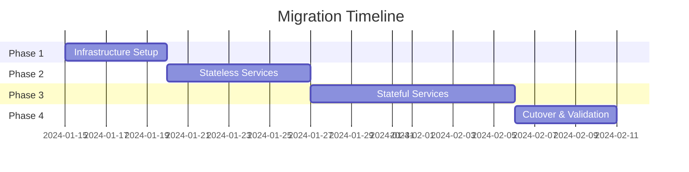

# Migration Strategy: Docker Swarm to Kubernetes

> Task 6.1: Comprehensive Migration Planning Document

## Executive Summary

This document outlines a phased migration strategy for transitioning our microservices application stack from Docker Swarm to Kubernetes. The migration prioritizes minimal downtime, data integrity, and operational continuity while leveraging Kubernetes' enhanced scalability and ecosystem.

---

## 1. Current State Assessment

### Docker Swarm Features in Use

Our current Docker Swarm deployment utilizes the following features that require equivalent Kubernetes implementations:

| Swarm Feature | Current Usage | Kubernetes Equivalent |
|---------------|---------------|----------------------|
| **Services** | 5 replicated services (frontend, backend, postgres, redis, traefik) | Deployments (stateless) / StatefulSets (stateful) |
| **Swarm Secrets** | Database credentials, API keys (3 secrets) | Kubernetes Secrets (base64 encoded) |
| **Configs** | Application configuration JSON | ConfigMaps |
| **Overlay Networks** | 4 encrypted networks (public, frontend, backend, monitoring) | Network Policies + Services |
| **Placement Constraints** | Node labels for database, role-based placement | Node Selectors / Node Affinity |
| **Volume Mounts** | Named volumes for PostgreSQL, Redis, Grafana | PersistentVolumeClaims (PVCs) |
| **Health Checks** | HTTP/TCP health checks with intervals | Liveness/Readiness Probes |
| **Traefik Ingress** | Label-based routing, SSL termination | Kubernetes Ingress + Ingress Controller |
| **Rolling Updates** | Parallelism, delay, failure action | Deployment RollingUpdate strategy |

### Services Inventory

| Service | Type | Replicas | State | Migration Complexity |
|---------|------|----------|-------|---------------------|
| Frontend | Stateless | 3 | Deployment | Low |
| Backend | Stateless | 3 | Deployment | Low |
| PostgreSQL | Stateful | 1 | StatefulSet | High |
| Redis | Stateful | 1 | StatefulSet | Medium |
| Traefik | Stateless | 2 | DaemonSet/Deployment | Medium |
| Prometheus | Stateful | 1 | StatefulSet | Medium |
| Grafana | Stateful | 1 | StatefulSet | Medium |

---

## 2. Migration Approach: Phased Migration

We recommend a **phased migration** approach over a big-bang migration for the following reasons:

### Why Phased Migration?

1. **Risk Mitigation**: Issues can be identified early without affecting the entire system
2. **Rollback Capability**: Each phase can be rolled back independently
3. **Learning Curve**: Team gains Kubernetes experience progressively
4. **Continuous Availability**: Production traffic maintained throughout migration

### Migration Phases



**Phase 1 (Week 1)**: Kubernetes cluster setup, CI/CD pipeline updates
**Phase 2 (Week 2)**: Migrate stateless services (frontend, backend)
**Phase 3 (Weeks 3-4)**: Migrate stateful services (PostgreSQL, Redis)
**Phase 4 (Week 5)**: Final cutover, monitoring, and validation

---

## 3. Tooling Strategy

### Conversion Tools

We will use a combination of tools for the migration:

| Tool | Purpose | When to Use |
|------|---------|-------------|
| **Kompose** | Automated compose-to-K8s conversion | Initial manifest generation |
| **Custom Scripts** | Fine-tuned conversions | Complex configurations |
| **Helm** | Template management, releases | Production deployments |

### Kompose Usage

```bash
# Convert docker-compose.yml to Kubernetes manifests
kompose convert -f docker-compose.yml -o k8s-manifests/

# Convert with Helm chart output
kompose convert -f docker-compose.yml --chart -o helm-chart/
```

**Kompose Limitations** (requiring manual adjustments):
- Swarm-specific deploy configurations not fully converted
- Secrets need manual recreation in Kubernetes
- Network policies require manual creation
- PV/PVC configurations need tuning for cloud providers

---

## 4. Detailed Conversion Mapping

### 4.1 Services → Deployments/StatefulSets

**Stateless Service (Backend) Conversion:**

```yaml
# Swarm
services:
  backend:
    deploy:
      replicas: 3
      update_config:
        parallelism: 2
        delay: 15s

# Kubernetes
apiVersion: apps/v1
kind: Deployment
metadata:
  name: backend
spec:
  replicas: 3
  strategy:
    type: RollingUpdate
    rollingUpdate:
      maxSurge: 2
      maxUnavailable: 0
```

**Stateful Service (PostgreSQL) Conversion:**

```yaml
# Kubernetes StatefulSet
apiVersion: apps/v1
kind: StatefulSet
metadata:
  name: postgres
spec:
  serviceName: postgres
  replicas: 1
  volumeClaimTemplates:
    - metadata:
        name: postgres-data
      spec:
        accessModes: ["ReadWriteOnce"]
        resources:
          requests:
            storage: 10Gi
```

### 4.2 Secrets → Kubernetes Secrets

```bash
# Create secrets in Kubernetes
kubectl create secret generic db-credentials \
  --from-literal=username=appuser \
  --from-literal=password=mysecurepassword

kubectl create secret generic api-secrets \
  --from-literal=api-key=api-key-12345
```

### 4.3 Overlay Networks → Network Policies

```yaml
# Kubernetes NetworkPolicy (backend isolation)
apiVersion: networking.k8s.io/v1
kind: NetworkPolicy
metadata:
  name: backend-network-policy
spec:
  podSelector:
    matchLabels:
      tier: backend
  policyTypes:
    - Ingress
    - Egress
  ingress:
    - from:
        - podSelector:
            matchLabels:
              tier: frontend
  egress:
    - to:
        - podSelector:
            matchLabels:
              tier: database
```

### 4.4 Placement Constraints → Node Affinity

```yaml
# Kubernetes Node Affinity
spec:
  affinity:
    nodeAffinity:
      requiredDuringSchedulingIgnoredDuringExecution:
        nodeSelectorTerms:
          - matchExpressions:
              - key: workload-type
                operator: In
                values:
                  - database
```

---

## 5. Testing Strategy

### Pre-Migration Testing

1. **Manifest Validation**: Use `kubectl apply --dry-run=client` to validate manifests
2. **Local Testing**: Deploy to kind/minikube for local validation
3. **Staging Environment**: Full deployment in staging Kubernetes cluster

### Parity Validation

| Test | Purpose | Method |
|------|---------|--------|
| Functional Tests | API responses match | Automated API tests |
| Performance Tests | Response times comparable | Load testing (k6/locust) |
| Data Integrity | Database content matches | Checksum comparison |
| Security Tests | Network isolation works | Network policy testing |

### Validation Script

```bash
#!/bin/bash
# Parity validation between Swarm and K8s environments

SWARM_URL="http://swarm.example.com"
K8S_URL="http://k8s.example.com"

# Compare API responses
for endpoint in "/api/health" "/api/status" "/api/users"; do
  SWARM_RESP=$(curl -s "${SWARM_URL}${endpoint}" | md5sum)
  K8S_RESP=$(curl -s "${K8S_URL}${endpoint}" | md5sum)
  
  if [ "$SWARM_RESP" = "$K8S_RESP" ]; then
    echo "✓ ${endpoint}: Responses match"
  else
    echo "✗ ${endpoint}: Responses differ"
  fi
done
```

---

## 6. Rollback Plan

### Phase-Level Rollback

Each migration phase includes a rollback procedure:

| Phase | Rollback Trigger | Rollback Procedure |
|-------|------------------|-------------------|
| Phase 2 | Service errors > 5% | Redirect traffic to Swarm services |
| Phase 3 | Data inconsistency | Restore from pre-migration backup |
| Phase 4 | Post-cutover issues | DNS failover to Swarm cluster |

### Critical Rollback Procedure

```bash
# 1. Redirect traffic back to Swarm (via load balancer/DNS)
# Update DNS or LB to point to Swarm endpoints

# 2. Stop Kubernetes deployments (optional)
kubectl scale deployment --all --replicas=0 -n production

# 3. Verify Swarm services healthy
docker service ls

# 4. Restore database from backup if needed
./scripts/restore-db.sh /backups/pre-migration.sql
```

---

## 7. Risk Assessment

| Risk | Probability | Impact | Mitigation |
|------|-------------|--------|------------|
| Data loss during migration | Low | Critical | Pre-migration backups, staged migration |
| Extended downtime | Medium | High | Blue-green deployment, traffic splitting |
| Performance degradation | Medium | Medium | Performance testing, resource tuning |
| Team unfamiliarity with K8s | High | Medium | Training, documentation, gradual rollout |
| Network policy misconfiguration | Medium | High | Thorough testing in staging |

---

## 8. Timeline Estimate

| Week | Phase | Activities | Deliverables |
|------|-------|-----------|--------------|
| 1 | Preparation | K8s cluster setup, CI/CD updates, Helm charts | Production-ready cluster |
| 2 | Stateless Migration | Frontend/Backend deployment, ingress setup | Services running in K8s |
| 3 | Stateful Migration | Database migration with replication | Data synchronized |
| 4 | Testing | Load testing, security validation | Test reports |
| 5 | Cutover | Traffic migration, monitoring setup | Full production on K8s |
| 6 | Cleanup | Swarm decommission, documentation | Migration complete |

---

## 9. Success Criteria

The migration will be considered successful when:

- [ ] All services running in Kubernetes with equivalent functionality
- [ ] Zero data loss confirmed through checksums
- [ ] Performance within 10% of Swarm baseline
- [ ] All monitoring and alerting operational
- [ ] Runbooks and documentation updated
- [ ] Team confident in K8s operations

---

## 10. Post-Migration Optimization

After successful migration, consider:

1. **Horizontal Pod Autoscaler (HPA)**: Automatic scaling based on metrics
2. **Vertical Pod Autoscaler (VPA)**: Right-sizing resource requests
3. **Pod Disruption Budgets (PDB)**: Ensure availability during maintenance
4. **Service Mesh**: Istio/Linkerd for advanced traffic management
5. **GitOps**: ArgoCD/Flux for declarative deployments
